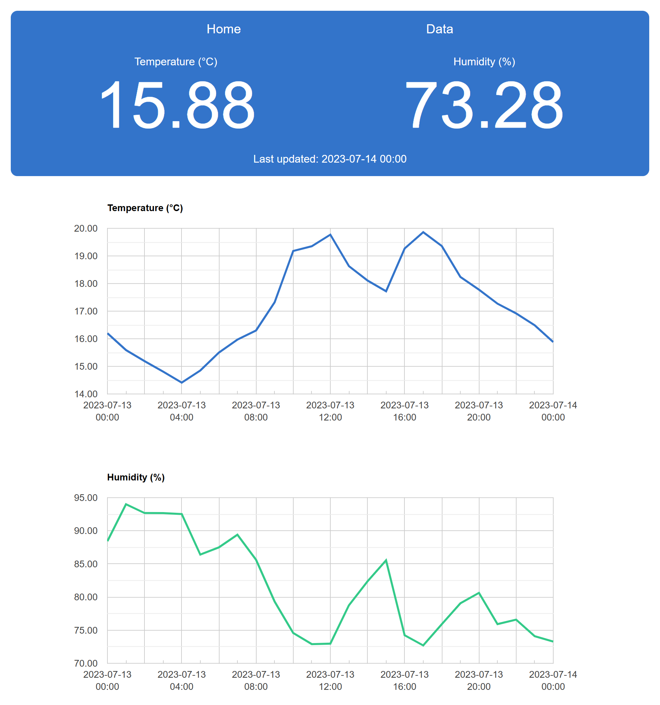
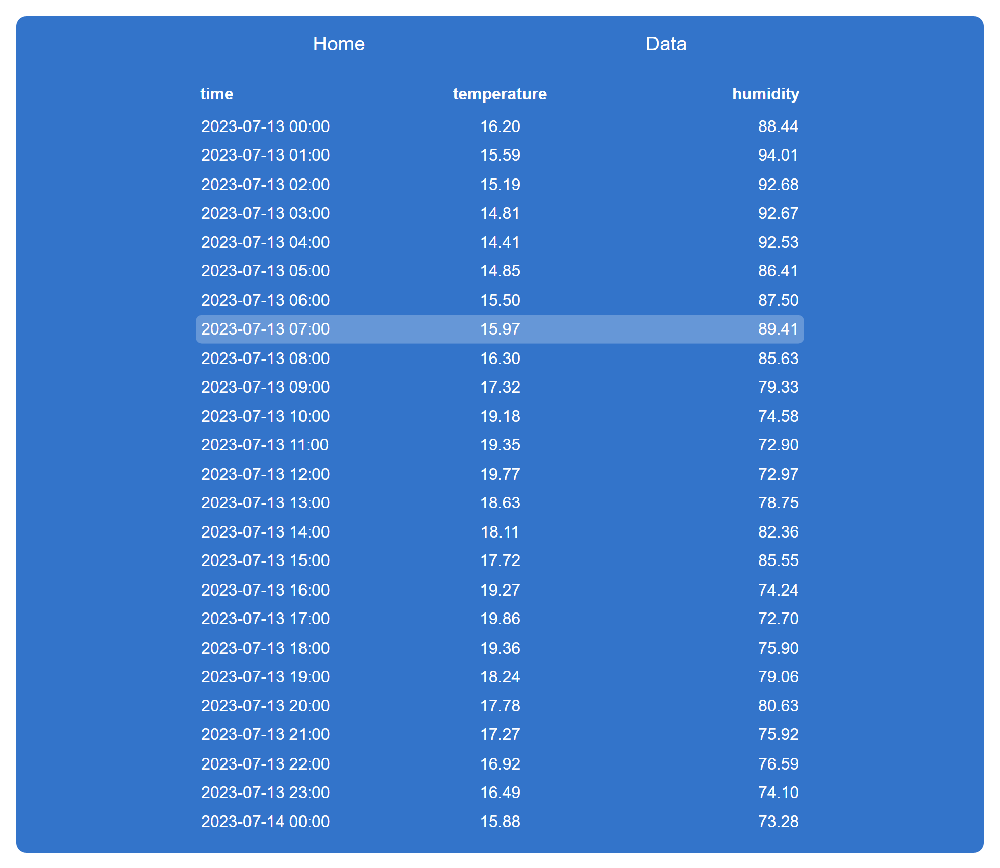

# Weatherman

A simple web application in Flask that displays temperature and humidity data
from an SQLite database. The application is [automatically deployed](https://weatherman.onrender.com/)
on push to the `main` branch of this repository.

## Index page



## Data page



## Running locally

It is also possible to run the application locally on your machine. Before
following the steps below make sure that you have Python installed.

### Create a new virtual environment for Python

```bash
python -m venv .venv
```

### Activate the virtual environment

```bash
.\venv\Scripts\activate
```

### Install required dependencies

```bash
pip install -r requirements.txt
```

### Start the application

```bash
flask run
```
